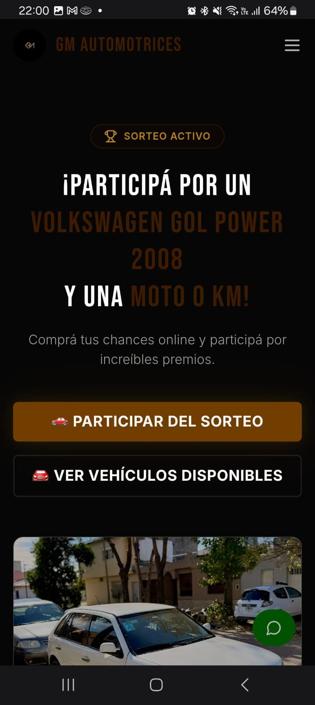
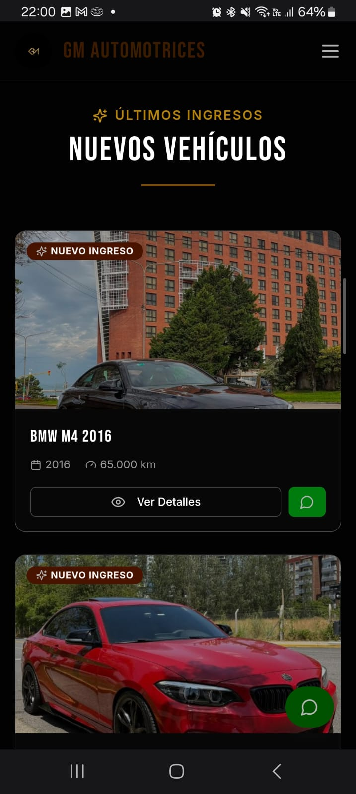
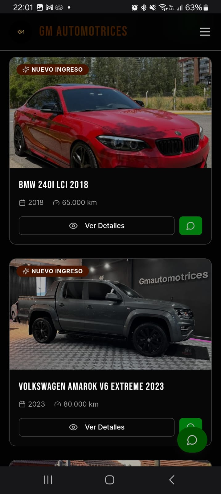
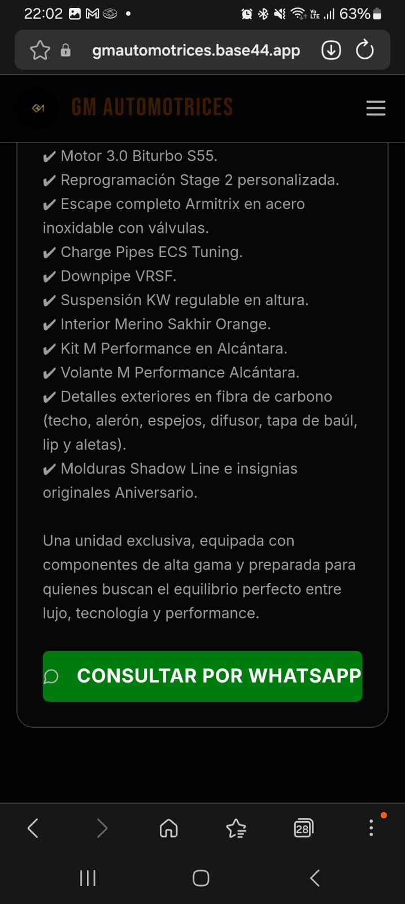

# Automotive Sales Website

Automotive sales website created to showcase vehicles, manage customer inquiries and support digital marketing campaigns.

This project was developed using Base44 and focuses on vehicle presentation, customer communication, digital marketing and sales conversion.

## Live Website

[View the automotive sales website](https://gmautomotrices.base44.app)

## Main Features

- Responsive design for mobile devices
- Vehicle catalog
- Search and filtering options
- Detailed vehicle information
- WhatsApp integration
- Customer inquiry buttons
- Digital sales-focused interface

## Screenshots

### Homepage

### Vehicle Listings

### Vehicle Catalog

### Vehicle Details and WhatsApp Integration

## Tools Used

- Base44
- Responsive Web Design
- WhatsApp Integration
- Digital Marketing
- Automotive Sales

## Project Author

**Liana Gisel Zapico Villalba**

[GitHub Profile](https://github.com/Liana2304)
